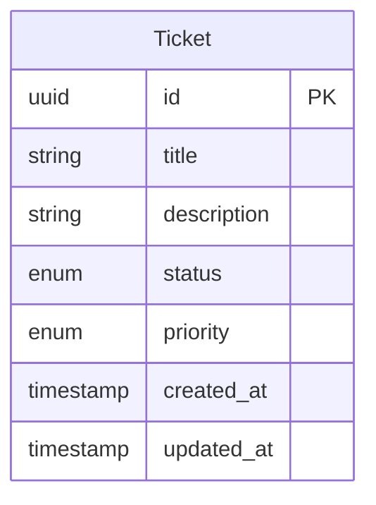

# Data Model

## Overview

Single-entity model for M2: **Ticket**. No user/auth entities in this phase.

## Entity Definitions

### Ticket

| Field | Type | Constraints |
|-------|------|-------------|
| `id` | UUID | Primary key, auto-generated |
| `title` | VARCHAR(200) | Required |
| `description` | TEXT | Required, min 10 characters |
| `status` | ENUM | OPEN, IN_PROGRESS, RESOLVED, CLOSED — default OPEN |
| `priority` | ENUM | LOW, MEDIUM, HIGH — default MEDIUM |
| `created_at` | TIMESTAMPTZ | Auto-set on create |
| `updated_at` | TIMESTAMPTZ | Auto-updated on change |

## Relationships

None in M2.

## Field Validations

- **title:** non-empty, max 200 characters
- **description:** non-empty, min 10 characters
- **status:** must be a valid enum value
- **priority:** must be a valid enum value

## State Transitions

| From | Allowed transitions |
|------|---------------------|
| OPEN | IN_PROGRESS, CLOSED |
| IN_PROGRESS | OPEN, RESOLVED, CLOSED |
| RESOLVED | IN_PROGRESS, CLOSED |
| CLOSED | OPEN (reopen) |

## Authorization Rules

None — all operations are public in M2–M4.

## Edge Cases

- Deleting a non-existent ticket returns 404
- Invalid status transition returns 400 with allowed transitions
- Empty PATCH body returns 400
- Search is case-insensitive on title and description

## ER Diagram

